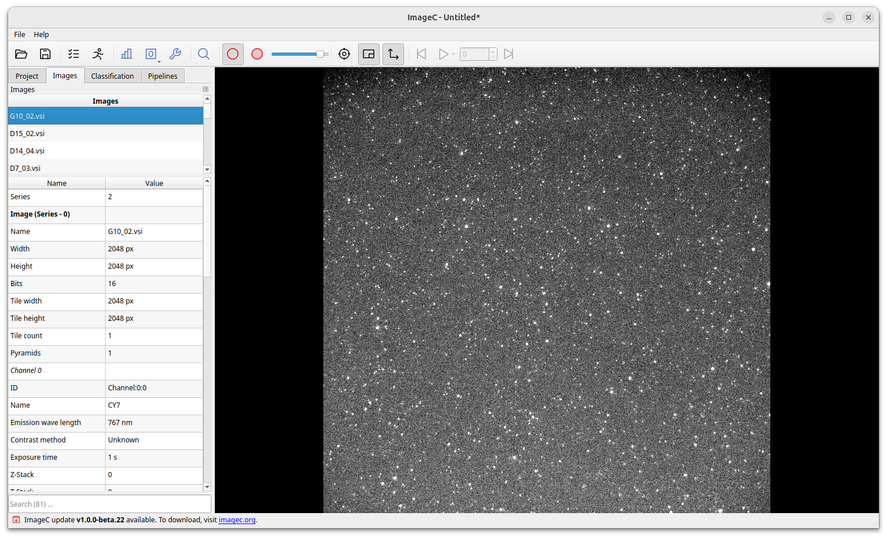
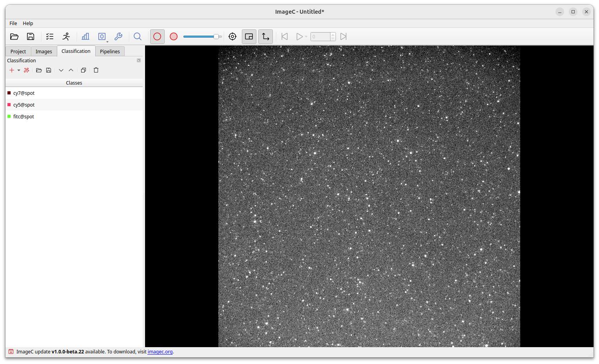
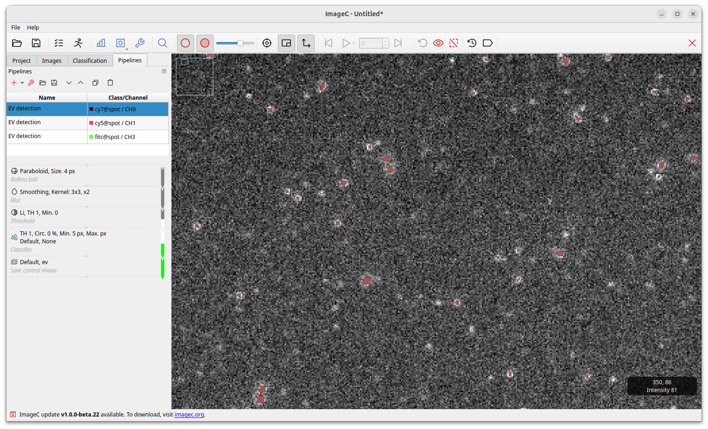

This guide takes you through your first steps with ImageC, helping you create your first ImageC project and start analyzing images.

> Tip Please read [Installation]() first and run ImageC on your computer before starting with this tutorial.

After download, unzip the downloaded data and use the `imagec` for Linux and macOS resp. `imagec.exe` for Windows to start ImageC.
The start page will be shown once ImageC is successfully launched.

As a start screen, an empty project, or predefined pipelines optimized for Image analysis within the EV-field (EVAnalyzer) can be loaded. Please find further information on the predefined pipelines under [EVAnalyzer](). These pipelines provide an example for pipelines with image processing, object detection and colocalization. 
Previously used settings and results can easily be loaded under "Open file". 

**Let's start with an empty project:** 
The tabs in the navigation pane on the left hand side are used to enter basic settings.
Navigate from the left `Project` tab over the `Image` to the `Classification` tab.
Once all settings in these tabs are done, you can start creating image processing pipelines in the `Pipeline` tab.

## Project {#project-tab}

Starting with the project settings, basic information about the experiment and the used image setting must be entered.

|Title                   |Description                                                      | Mandatory
|-------------           |-----------------------                                          |---------- |
|Image directory         |Storage Directory of the images to be analyzed. All images found within this directory are analyzed using the same pipeline.                   |x          |
|Job name                |Name of the job to identify the run (auto generated if empty).   |x          |
|Grouping                |Images may be left ungrouped, or can be grouped by Filename regex or Folder.|x |
|Plate size              |If images are sorted based on microscopy plate designes, the size of the used microscopy plate needs to be entered. Image layout within the well can be defined within the plate settings dialog.                              

### Image directory

In `Image Directory` the image folder with all "to be analyzed" images is selected. Within this folder, ImageC will perform a recursive folder search to find all supported image files.
All found image-files are listed in the `Images` panel.

> Tip See section [Images](#images) for a full list of all supported image formats.

### Image Grouping {#image-grouping-tab}

Images can be grouped by `Foldername` or `Filename`, resulting into image grouping based on the selected grouping parameters and the calculation of statistics within the selected the group. 

Grouping based on filename can, for example be helpful when cell culture plates are imaged and the images should be grouped by wells. e.g. for 96 well plate A1-H12. Filename grouping uses regex (regular expressions) to extract the position on the plate and the position of the image in the well from the image filename.
Extracted are: plate `row` and `column` position and the image `index` in the well.

A change of the grouping settings after analysis is currently not supported by ImageC. 
If the grouping settings are changed the analysis has to be repeated.

> Warning Make sure that the grouping options and regex settings are correct, as they are needed for valid image sorting and mean well infos. However, if the grouping settings are wrong, these statistics will also be calculated in a wrong way.

> To extract the well position using regex from the filename correct, it es expected that the row position in the filename is a character in the range of `[A-Z]` and the column and index a decimal number.
A typical series of file names for the regex {regexp}`_((.)([0-9]+))_([0-9]+)` might look something like the following:
>
> 
> 
> `name_A1_1.tif`
> `name_A1_2.tif`
> `name_A1_3.tif`
> `name_A1_4.tif`
> `name_A2_1.tif`
> `name_A2_2.tif`
> `name_A2_3.tif`
> `name_A2_4.tif`
> 
> To experiment with regular expressions, have a look at [regex101](https://regex101.com/).

> Best Practice Example for folder, filename and plate grouping

## Images {#images-tab}

Once a image directory has been selected and the folder scan is complete, all the images found will be listed in the table located in the `Images` tab.

By clicking on an image the image is selected and meta information is loaded and displayed in the properties table below.
The image selected in this tab is also the image used in the pipeline preview.

To the bottom of the tab bar, a search field allows to filter the images in the list against its filename.

## Classification {#classification-tab}

First before creating pipelines and starting the analysis the object classes must be defined.

A separate object class must be defined for each object type to be extracted from the images. 

> Best practice If I want to detect Protein A and Protein B and I want to see if Protein A colocalizes with Protein B, I have to define "Protein A" and "Protein B" and additionally I have a group of "ProteinA-coloc-ProteinB" and "ProteinA-non-coloc-ProteinB" to seperate the population of all Protein A to the ones that are colocalizing and the ones that are not. Then I am able to seperatly look at features of all of these classes.
> 
ImageC allows to either define your own classes, load a preset of classes from a template or try to automatically populate classes, using the magic stick button, based on the image meta data and channels.

> Tip Class names can consist of two parts, separated by an `@`. The first part is used to sort the classes in the drop down boxes to help you keep track of them. Example object classes might be: `proteinA@all`, `proteinA@coloc_proteinB`, `proteinA@noncoloc_proteinB`. - then all proteinA classes are grouped together.

Double click on a class opens the Class editor.
The Class Editor is used to define the class name and the color used for the preview of the detected objects.
In addition the Metrics section shows all parameters measured for the objectallows to define the object metrics to be displayed per default in the results view.
However, the measurement settings per object class can be changed at any time without having to rerun the analyses.

> Double click on a class opens the pipeline editor.
> Selected metrics are displayed per default in the results view after the analyses has been finished but can be changed at any time without having to rerun the analyses.
>
> 

## Pipelines {#pipelines-tab}

The pipelines tab is used to create image processing pipelines which are used to extract objects of interest from the image channels.
ImageC has no limit in the number of pipelines which can be added to a project.
During a analyzes ImageC, processes each active pipeline.
The optimal processing order and parallel processing of the different pipelines is determined by ImageC automatically based on available CPU cores and possible pipeline dependencies.

By clicking on the arrow beside the `Plus` button a drop down with predefined analyzing pipelines is opened.
All past EVAnalyzer pipelines are included in this version, marked with the small EV icon to the left. 
Select `EV channel` for loading a pipeline (preprocessing, object filtering, segmentation) optimized for EV quantification from single vesicle imaging images with low background. 
Select `Cell brightfield` for loading a pipeline (preprocessing, object filtering, segmentation) optimized for cell segmentation on brightfield images.
Select `Nucleus` for loading a pipeline (preprocessing, object filtering, segmentation) optimized for nucleus segmentation after fluorescent labelling of the nuclei (e.g. Hoechst, DAPI).
Select `EV in cell` for loading a pipeline (preprocessing, object filtering, segmentation) optimized for EV quantification in complex material like cells.
Just press the `New pipeline` button to start with an empty pipeline.

> Bestpractice It is a good practice to add one pipeline for each image channel to extract objects from and one pipeline for each object processing step like Coloc or in cell counting.

By click on a pipeline, the pipeline editor is opened.
On the left hand side the input and output options can be defined.
The input of a pipeline can either be an image channel or an empty image.

The `Pipeline steps` box contains all commands which are applied on the input image.
All steps are performed from top to bottom.
Each step can take either an image or a set of objects as input and either an image or a new set of objects as output.
Based on the used command either the image is processed, objects are extracted or objects are processed.
The color bar next to the command indicates the type of command.

> Tip See the section [Pipeline steps](pipeline-steps) for detailed information about the available pipeline steps and their behavior.

Gray commands manipulate images, white command work on binary images and green commands work on objects.
Translation commands translate the output from one input type to an other output type.
For example, a threshold command translates an image (grey) into a binary image (white) and an object classification command translates a binary image (white) into objects (green).

A live preview is displayed on the right.
It shows the resulting object segmentation after all applied pipelines steps.
Changing a parameter will directly change the preview, enabling a fast and easy adjustment and fine-tuning of the settings. 
A live object count is displayed in the legend of the preview image.

Based on image size and the complexity of the selected preprocessing algorithms it could take a couple of seconds for refreshing the preview.
The preview can additionally be zoomed in and out and a second window with the original image and the processed image side by side further enables smooth segmentation setting. 

### Starting the analysis

After all pipelines are created, the analysis can be started by pressing the `Play` button on the top.

A dialog box informs you about the progress of the analysis.
At the bottom left of the dialog a `Open results folder` button is placed.
Press this button to open the file explorer showing the folder with results of the actual analysis run.

With `Stop` button a running analysis can be interrupted.
It may take a couple of minutes to stop a running analysis since all still in progress tasks have to be finished.

Press the `Close` button to close the dialog after a successful finished analysis run.
