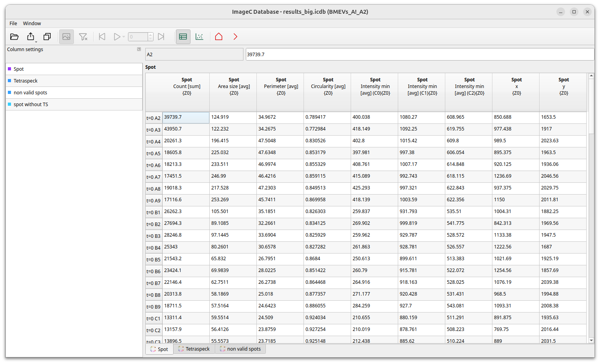

ImageC stores the results of a analysis run within a database file named `results.icdb`.
Results from a previous run can be opened by clicking the arrow beside the `Open` button on the toolbar.

Once a results file is opened the first time, the measurement values selected in the [class editor](#classification-tab) are displayed in the table plate view.

To add additional metrics press the blue `Add column` button.
The opened Add Column dialog displays all available metrics which can be added to the table.

ImageC saves the actual table settings with the database file so that they are restored the next time the results are opened.

> See section [Metrics]() for a complete description of the available metrics.


## Plate view

ImageC opens the `Plate` view panel per default.



The plate shows the results grouped by well as average value of the selected statistics from the images of the group.

> Image grouping must be setup before the analyze is started in the [Project tab](#image-grouping-tab).
> If `Ungrouped` was selected as `Group by` method, the plate view is not shown and ImageC directly jumps to the image list view.

Using the heatmap button the view can be switched from a table view to a heatmap view.


Wells are coloured using a  heatmap calculated from all data displayed, with the mean value of all wells as the centre of the spectrum and the minimum and maximum as the outer left and outer right limits of the spectrum.
In heatmap view a dropdown in the toolbar allows to select which column of the table should be displayed as heatmap.

## Image view

A double click on a well in the heatmap view or a column in the table view will prompt the opening of a detailed view of the selected well.


The `Image view` displays each image of the well ordered by the image index specified in the `Well order` matrix.
The image index was extracted from the filename during the analysis using the specified regex.
To reorder the image position displayed in the well view matrix use the `Well order` settings field.

> A string formatted order matrix can be used to customize the order of images displayed in the well order matrix.
> Per default the matrix is set to: `[[1,2,3,4],[5,6,7,8],[9,10,11,12],[13,14,15,16]]`.
> The numbers in the square brackets are the image indexes, where each comma-separated square block represents a row and the comma-separated numbers represent columns.
> This results in the following screen sequence for the example above.
> 
> 


If images are to be excluded from the statistics, this can be done via the exclude menu item {{icon_unavailable}}.
As invalid marked images are crossed out and are not taken into account in all subsequent calculations.

## Image detail view {#image-detail-view}

To go one step deeper, looking into detail information about a single image, double click on an image in the `Image view`.

The density view presents a density map of the image.
In the bottom left sidebar the are size to b used for calculate the density map can be chosen.
ImageC calculates the average value of the selected measurement of all valid objects within this squares.

The square size can be changed using the left hand side panel.
Be careful though, if the square size is too small for large images, you may run out of RAM.


> Tip It is possible to view the details for multiple images at once by selecting the image rows in the table view and using the open arrow in the navigation bar.
>
> <a href="images/screenshot_open_multiple_details.png" data-lightbox="object-detection-coloc"></a>

### Interactive mode {#interactive-mode}

In image detail view mode ImageC displays the metrics for each individual detected object.
When an object in the table is selected, ImageC opens the image that the object was extracted from and highlights the position in the image where the object was found.

The position of each object in the image can be identified using this feature.
However, ImageC needs access to the original images for a correct working interactive mode.
If the `results.icdb` file or the images are moved, ImageC will prompt you to specify the new storage location.

> Bestpractice For ImageC to automatically find the images for interactive mode, it is best practice to keep the `results.icdb` file in its original folder, as this was where it was generated.
> ```
> <images_folder>
>  |- <image_01>
>  |- <image_02>
>  |- ....
>  |- imagec
>      |- <job_name>
>          |- results.icdb
> ```
>
>


## Data export {#data-export}

The Download button {{icon_download}} allows the current settings to be exported as either XLSX or R.
