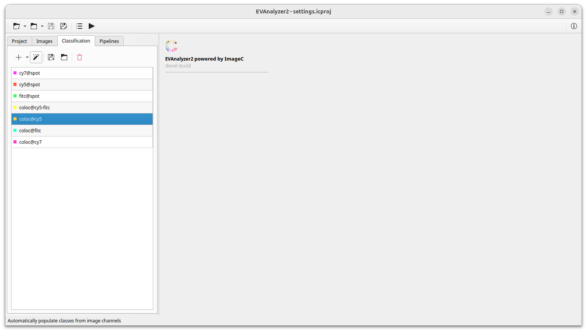

The concept behind ImageC is to run pipelines containing image pre-processing and object segmentation steps with the goal of extracting regions of interest from the input images.
For each extracted [object](#objects) the origin information: image, image channel, z-stack and t-stack and some metrics are stored.
In advanced, each [object](#objects) is classified for object statistics calculation and later quantification.
For classification ImageC provides the annotations `Object Class`.
Every object is annotated with exact one object class.

## Classes

The first step before creating pipelines or starting the analysis is to define which classes are needed for object classification in your application using the [Classification tab](#classification-tab).

Classes represents the populations which should be distinguished.

Use the `Plus` button to add a new class.
In addition to the color, the name and the default displayed metrics for the class can be specified.
Using the `@` symbol allows to group classes for a better reading in the selection tab.

Instead of manually specifying all required classes, ImageC provides the ability to populate the classification settings from the image channel information using the `Magic Stick` button.

> Bestpractice It is a best practice to use the fluorophor as prefix followed by the object type: `dapi@nucleus`, `cy5@spots`, `cy@spots-in-cell`. 
> For processed objects use the process operator: `coloc@cy5cy7-spots`.

## Classification presets

ImageC also allows to create classification presets by selecting a preset from the drop down of the `Plus` button.
A classification preset is a set of predefined classes which can be loaded and shared with others.
The idea behind a preset is making results easier comparable by using the same nomenclator for each analysis.

Using the `Save as template` option allows to create a new preset from an existing settings.