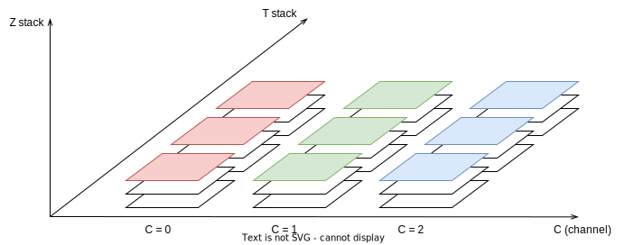
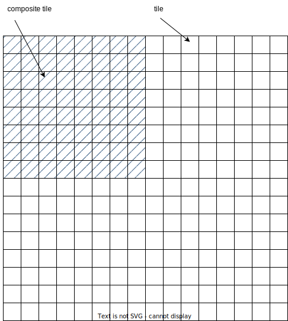

ImageC can be used with a wide range of image formats, thanks to the open source library **Bio-formats**: <https://docs.openmicroscopy.org/bio-formats> which is shipped together with ths application.

Following 8-bit or 16-bit grayscale and 8-bit RGB color images are supported:
```
tif,tiff,btif,btiff,btf,jpg,jpeg,vsi,ics,czi,
nd2,lif,lei,fli,scn,sxm,lim,oir,top,stk,nd,
bip,fli,msr,dm3,dm4,img,cr2,ch5,dib,ims,pic,
raw,1sc,std,spc,avi,cif,sif,aim,svs,arf,sld
```

A full list of all supported image formats can be found on the [Bio-formats](https://docs.openmicroscopy.org/bio-formats/5.8.2/supported-formats.html) homepage.

> Warning There are some special Photoshop tiff formats which are not supported. When using tiff images take care about using either RAW tiff or the [OME-TIFF](https://docs.openmicroscopy.org/ome-model/5.6.3/ome-tiff/) format for multi channel support.


> Bestpractice Use RAW images directly from your microscope without any pre-processing or compression for the best detection results.

ImageC can handle multi channel images as well as big histological images without the need of any preprocessing.
Use the images directly as they were captured by the microscope camera, without any compression or pre-processing to get the best results.

Especially for multi-channel images, avoid merging the channels into an RGB color image for processing, as most of the image information will be lost.
Use the original multichannel image and use ImageC pipelines to process each of the channels individually to extract the objects of interest.


## Image planes {#image-planes}

Microscope images usually consist of several individual images that are summarized in a common image file.
This individual images are named image planes.
Each plane is identified by its channel, z-stack and time stack.

ImageC is able to access each image plane of an image and process these planes individually based on the taken project and pipeline settings.


> An image may comprise one or more C (channels), with each channel in turn consisting of a series of T (time) stacks, and these in turn consisting of a series of Z stacks.
> 
> The combination channel, Z stack (z) and time stack (t) is called image plane.
> ImageC is able to process each image plane of an image, based on the taken project and pipeline settings.
> 
> 


Within a pipeline, select the image channel to be loaded as the starting point for this pipeline.
The channel is a number from 0 to x.
A separate pipeline must be created for each image channel required for processing.

In a second step it is necessary to define how z-stacks and time stacks should be processed.
These settings can be taken in the `Project` tab of ImageC.
It is possible either to process each Z-stack image individually, using a projection algorithm to combine all the images of a Z-stack into a single stack image, or to analyze exactly one image of the Z-stack.
If a projection algorithm is to be used, the algorithm to be used must be defined within the individual pipeline.
For the time stack it is possible either to analyze one image of a time stack or to analyze the whole time series.

## OME xml {#formats-ome}

ImageC supports reading OME XML meta data stored beside image files.

OME specifies a structure how image meta can be shared in a standardized way.
ImageC tries to parse this XML data if it is found in an image and displays the meta data in a sidebar on the start screen.

The OME metadata contains not only image metadata for the end user, but also information about the number of channels and the channel order.
Therefore, OME metadata is mandatory if multi-channel images are to be processed.

ImageC assumes that only one channel is available if no OME metadata is found.

> Tip For a full specification OME see <https://ome-model.readthedocs.io/en/stable/ome-xml/index.html>


## Big images {#big-images}

Because computing resources are limited, image size can be a limiting factor when working with histological images, particularly during analysis.

One of the hardest limits is an image resolution of `46340x46340` pixels, which exceeds the 32-bit signed data type limits of many common image processing algorithms.
In addition to this data type limitation, most personal computers have limited RAM, which restricts the maximum image size that can be analyzed.

ImageC solves both issues by automatically breaking large images down into smaller pieces called image tiles.
The maximum tile size can be specified in the [project settings tab](#project-tab).

If an images is loaded which is bigger than this specified tile size, ImageC analyzes tile by tile instead of the whole image at once.
After the analyses are finished, ImageC will automatically combine the results from each tile to create a full image result again.
From a user's perspective, the large image can be analyzed with ImageC as is to get results for the entire image.

> The big tiff file format breaks the the 4 gigabyte (32-bit) size limit in comparison to the normal tiff format.
>
> BigTIFF images are usually split into tiles whereby a typical tile size is `512x512 px`.
> When analyzing, ImageC opens in this example `64` tiles at once and analyses one such composite tile after another.
> This is necessary because when working with such large images, the entire image cannot be loaded into RAM at once.
> 
> 


> Warning ImageC can only generate a navigation map if the large image is stored as a pyramid image.
> When working with large images, ensure that only supported image formats are used and that the image container contains a pyramid representation of the image.


For large images, ImageC generates a preview of only one tile to avoid exceeding the computer's RAM limits.
The image map navigator within the preview window allows you to navigate through the different image areas.

Following image formats support big images including pyramid images:

```
.afi, .svs, .ims, .vsi, .ndpi, .ndpis,.jp2,.tiff
.tif, .tf2, .tf8, .btf, .tif, .sld, .jpg, .czi
```