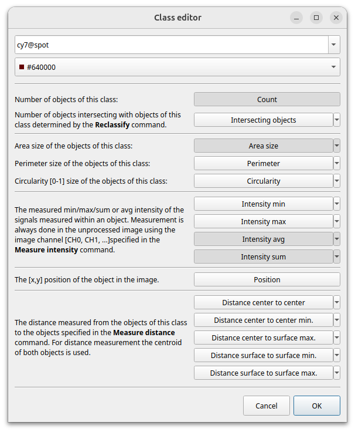

During an analysis ImageC measures a couple of metrics of each detected [object]().
All the measured data are stored in a SQL database on disk (internally we are using [DuckDB](https://duckdb.org/)).
Once the analysis is finished the collected data can be displayed within the ImageC results viewer and either be exported to **XLSX** or **R** afterwards.

However, as the number of data generated can be very large, ImageC allows to choose which data to display in the result view.
One way to specify the columns to show is using the [class edit](#classification-tab) dialog in the classification tab.

When the result file is opened after a run, ImageC displays the result columns as specified there.
Even if a column is not specified, the metric is still measured and can be added at any time, even after the analysis has been completed.

## Metrics {#metrics-and-statistics}

A measurement in the context of ImageC is a metrics calculated during the analysis for an object.
The statistics is applied to the selected measurement.
The following table gives an overview of the available metics and statistics:

|Metric                          |Description                                           |
|-------------                   |-----------------------                               | 
|Count                           |The number of detected objects in the image.          |
|Intersection                    |The number of objects intersecting with this object.  |
|Area size                       |The object area size.                                 |
|Perimeter                       |The object perimeters.                                |
|Circularity                     |The object circularity.                               |
|Intensity min                   |The object min intensity.                             |
|Intensity max                   |The object max intensity.                             |
|Intensity avg                   |The object avg intensity.                             |
|Center of mass X                |X coordinates of the center of mass of the object in the image. |
|Center of mass Y                |Y coordinates of the center of mass of the object in the image. |
|Object ID                       |Unique object ID.                                     |
|Origin object ID                |If it was copied by reclassify this is the Object ID of the object this object was copied from. If not copied the value is 0.|
|Parent object ID                |If the object was reclassified using intersection, this is the Object ID of the object this object was intersecting with. If not reclassified the value is 0. |
|Tracking ID                     |If the object has been tracked e.g. by coloc or timeframe, all related objects will have the same tracking ID. The table is sorted by Tracking ID.                         |
|Distance from object id         |The object ID of the object the distance was calculated from |
|Distance to object id           |The object ID of the object the distance was calculated to |
|Distance center to center       |The distance from the "From" object to the "To" object measured from centroid to centroid. |
|Distance center to surface min  |The smallest distance from the "From" object to the "To" object measured from centroid to surface. |
|Distance center to surface max  |The highest distance from the "From" object to the "To" object measured from centroid to surface. |
|Distance surface to surface min |The smallest distance from the "From" object to the "To" object measured from surface to surface. |
|Distance surface to surface max |The highest distance from the "From" object to the "To" object measured from surface to surface. |

## Statistics

Following statistics are calculates for each of the metrics.
Statistics are only calculates for Plate and Well view

|Statistics | Description     |
|-----------|-----------------|
|CNT        |Nr. of elements used to calculate the statistics|
|AVG        |For image view: Average value of the image. For plate view: Average of the average values of the images of the selected well.|
|MEDIA      |For image view: Median value of the image. For plate view: Average of the median values of the images of the selected well.|
|MIN        |For image view: Min value of the image. For plate view: Average of the min values of the images of the selected well.|
|MAX        |For image view: Max value of the image. For plate view: Average of the max values of the images of the selected well.|
|STDEV      |For image view: Standard deviation of the image. For plate view: Average of the standard deviations of the images of the selected well.|
|SUM        |For image view: Sum of all values of the chosen metric of the image. For plate view: Average of the sum values of the images of the selected well.|