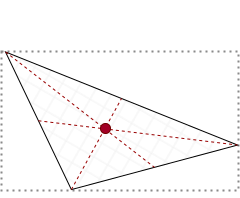

Objects are the result of an image [classification step]() and represents the quantified data of an formally extracted region of interest.
Objects are the final part of an ImageC pipeline and are those elements which are finally stored to the results database.

Each object is assigned to exact one object class to scope it.
Together with the classification labels some object metrics are calculated.
ImageC distinguishes between [image plane](#image-planes) independent and [image plane](#image-planes) dependent metrics.
Image plane independent metrics are globally valid for the object whereby image plane dependent metrics are calculated based on the image pixel data.

> Tip See section [Metrics]()  to get an overview of the image plane dependent object metrics.

## Confidence

The confidence interpretation depends on the used segmentation mode.
For [threshold](command-threshold) segmentation the confidence value is the minimum threshold which was used to finally extract the object from the rest of the image.
The number range is from zero to 65535.

If [AI classifier](command-classifier-ai) is used the confidence value represents the output prediction probability of the used AI model.
The number range is from zero to one.

## Area size

The area size is defined by the number of not black pixels within the shape of the extracted region of interest.
It's unit is px^2.

## Perimeter

The perimeter calculation has been ported from ImageJ to ImageC.

The algorithm counts pixels in straight edges as 1 and pixels in corners as \\(\sqrt{2}\\).
It does this by calculating the total length of the ROI boundary and subtracting \\(2-\sqrt{2}\\) for each non-adjacent corner. 
For example, a 1x1 pixel ROI has a boundary length of 4 and 2 non-adjacent edges so the perimeter is \\(4-2\cdot(2-\sqrt{2})\\). 
A 2x2 pixel ROI has a boundary length of 8 and 4 non-adjacent edges so the perimeter is \\(8-4\cdot(2-\sqrt{2})\\).

## Circularity

Circularity defines the "roundness" of an object.
In other words, how similar the object is to a circle.
The value is in range of zero to one, whereby one stands for a perfect circle!
The circularity of an object is calculated as follows:

$$
c = \frac{4 \cdot pi \cdot AreaSize}{perimeter^2}
$$

## Centroid /Position

The centroid is the geometrical center of an object.
This is the average of the x and y coordinates of all of the pixels in an object.
It's coordinates are calculated by the first order spatial moments.

$$
c_x = \frac{m_{10}}{m_{00}}
c_y = \frac{m_{01}}{m_{00}}
$$

<!---->

## Bounding box

The bounding box is the smallest square which can be drawn to include all pixels of the object within the box.

## Object ID

During the object detection of a run, ImageC assigns an ID to each detected object, starting with `1` for the first detected object.
This object ID is unique throughout the entire run, i.e. an object can be uniquely identified by this object ID.

Using the `With object ID` option of the [Image save](command-image-save) allows to plot the ID beside the detected ROI in the image.
Together with the results table, which also allows the ID to be displayed, each region of interest within the image can be matched to its metrics.

### Parent Object ID {#parent-object-id}

ImageC allows to build up a hierarchy of objects during a run using the [Reclassify](command-reclassifier) command.
Once an object has been discovered and assigned to an object class, the command can be used to change this class based on some criteria.

One of these criteria is the intersection of the object with an other one.
When this option is used, ImageC stores the object ID of the intersecting object (the parent) as the parent object ID together with the object with which the intersection is to be calculated. 
An object can have exact zero or one parent.

### Origin Object ID

Once an object is duplicated using the `Reclassify copy` option of the [Reclassify](command-reclassifier) command, the ID of the origin object is stored together with the duplicated object.
The origin object ID keeps the same even if a duplicated object is again duplicated.

## Tracking ID

The Object ID identifies an object uniquely within a run and the parent object ID gives information about the hierarchy of the objects.
The tracking ID, on the other hand, is used to link recognized objects that represent the same physical instance.

Example for such "same physical instances" are colocalizing objects from different image channels or moving objects in two different time frames,
In the actual version of ImageC, the colocalizing tracking is supported by using the [Colocalization](command-colocalization) command.

When using the colocalizing command each object which colocalizes gets the same tracking ID which allows later on to match those objects.

## Distance

The distance is the euclid-distance between two objects in px.
ImageC calculates following distances:

- Distance between the centroids of two objects
- Distance between the centroid and the surface of two objects
- Distance between the surfaces of two objects

The euclid-distance d is calculates with:
$$
d = \sqrt{(x_2-x_1)^2 + (y_2-y_2)^2}
$$

> Tip See command [distance measurement]() for how to measure the distance.

## Nr. of intersecting objects

Is the count of objects which are intersecting with an other object.