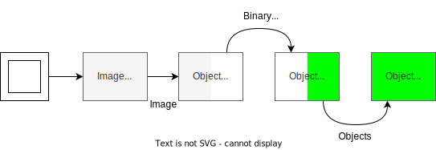
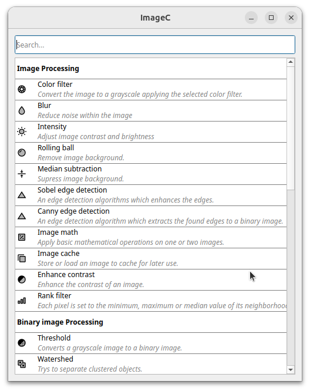

Clicking on an pipeline in the `Pipelines` tab opens the pipeline settings panel.

The final goal of a pipeline in ImageC is to get objects and classify them.
Objects can either be extracted from an image plane based on a region of interest using image processing and classification algorithms, or constructed from an existing set of objects using object math.

A typical way to extract objects from an image is to first define the image plane to be processed, set the classification information for the extracted objects, and add image preprocessing and classification steps. 
Then, perform some object math and filtering.

Finally, the extracted objects are stored in the resulting database along with their object metrics.

## Pipeline settings

The `Pipeline name` input allows to give the pipeline a meaningful name.
It is recommended to not use the same name for two pipelines in the same project to make failure analyzes much more easier.

Some of the processing steps are used to extract objects from the input images.
Each detected object is classified by assigning to exact on class.
The `Object class` setting allows to specify the default class that will be used for each detected object, unless specified otherwise within a pipeline step.

## Pipeline input settings

The `Pipeline input` defines the image plane which should be used as a starting point for this pipeline.
Mandatory field is the `Image channel`.

If the `Z-Stack` setting in the `Project` tab is set to `Intensity Projection`, it is necessary to select which intensity projection mode is to be used for the input channel of the images by selecting the `Z-Projection` mode.
If the the `Z-Stack` setting in the `Project` tab is set to `Each one`, nt additional settings have to be taken for the z-stack since each z-stack is processed individually.
If the `Z-Stack` setting in the `Project` tab is set to `Exact one`, it is necessary to specify which z-stack index to use for analysis, the default being zero (0).

Same settings have to be taken for the time stack depending on taken `T-Stack` settings in the `Project` tab.

In addition to start with an image plane as input it is also possible to start with an `Empty` image.
Using a blank image is useful for use cases where you are working with objects from a previous pipeline without having to extract objects again.

## Pipeline steps

> Commands are used to manipulate the input image, extract objects or to work on exiting objects.
> A command takes either an image plane or objects as input and returns a manipulated image or objects as output.
> In other words, based on the command category, the command either works on images or objects, or transforms an image into an object or vice versa.
> 
> This brings us to four principal categories of commands: image processing commands (gray), object segmentation commands (white), object classification commands and object post-processing commands (green).
> 
> As not every sequence of commands is possible in a meaningful way, ImageC indicates which command can be connected to the previous one.
> 
> 

The goal of each pipeline is to extract regions of interest from an image input plane and store these regions of interest as objects for further object processing.
ImageC provides a wide range of commands that can be used for this purpose.

By clicking on the **--- + ---** button within the pipeline step section, the command selection dialog is opened.
Commands are classified into four principal categories: image processing commands (gray), object segmentation commands (white), object classification commands and object post-processing commands (green).

When opening the command selection dialogue, this dialogue shows all the available commands that can be used at this pipeline position.
Double-click to insert the command.

A typical pipeline flow might look like this:

1. First of all image processing commands are used to reduce the image noise as much as possible.
2. Object segmentation commands are used to separate foreground from background by using threshold algorithms and convert the grey scale image to a binary image.
3. In the next step an object classification command is used to extract region of interests from the grey scale image and classify them to objects.
4. Object postprocessing and filter commands can be used to do further processing or filtering on the detected objects.

## Pipeline history

Using the `History` button to open the pipeline history.
The history list shows the last 64 changes taken in this pipeline.
The History tab allows you to go back in time and restore a setting by double-clicking on an entry in the history.

The `Tag` button can be used to mark the actual settings within the history, which allows an easy restore of these settings.